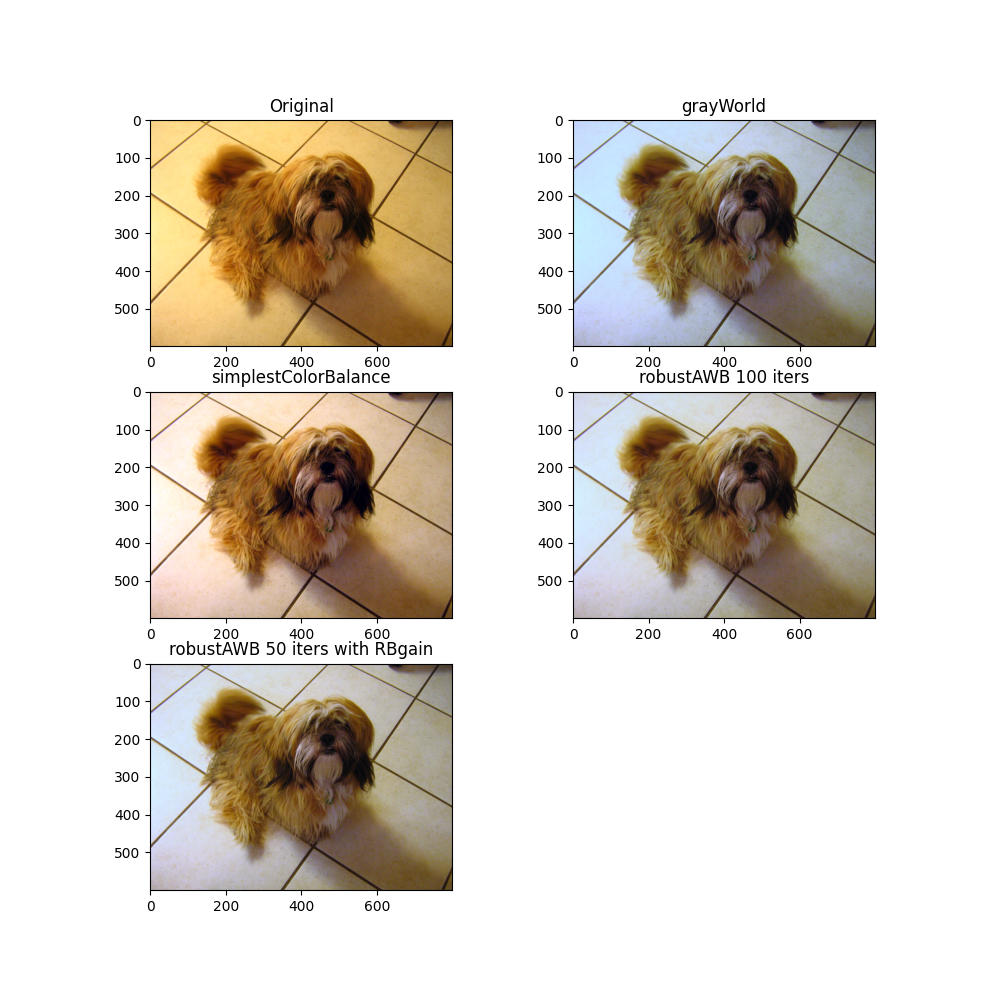

# cbimg - Color Balancing Algorithms

Python implementation of color balancing algorithms as can be found in:
https://web.stanford.edu/~sujason/ColorBalancing/index.html

Implemented:
    [x] grayWorld
    [x] simplestColorBalance
    [x] robustAWB

## Image Example

